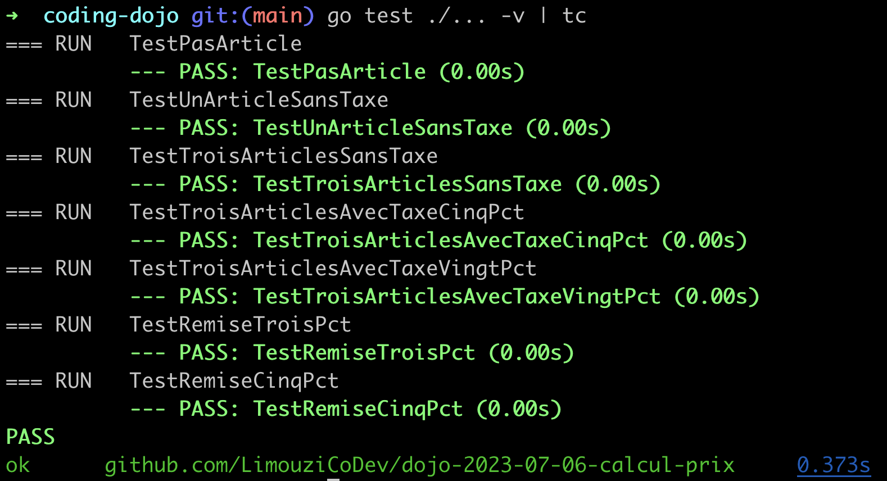

# dojo-2023-07-06-calcul-prix

Ce dépôt contient le code réalisé lors du meetup pour le kata [Calcul de prix](https://github.com/xnopre/xnopre-katas/blob/master/pricer.md).

## Configuration

- Installer Go : https://go.dev/doc/install

- Exécuter la commande `go run .` pour exécuter le code et installer automatiquement les dépendances. (Cela devrait afficher "Hello world!")

- Exécuter `go test ./... -v` pour exécuter les tests.

## Extras

Pour des résultats de tests plus agréables à lire, vous pouvez utiliser les modules suivants :
- [gotestfmt](https://github.com/GoTestTools/gotestfmt)
- [gotestsum](https://github.com/gotestyourself/gotestsum)
- [tc](https://github.com/danieldn/tc)

### Exemple :

```shell
$ go get github.com/danieldn/tc
$ go test -v ./... | tc
```

### Resultat:

